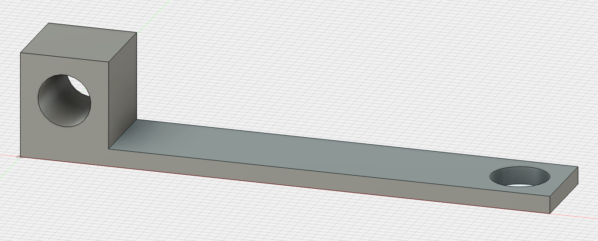
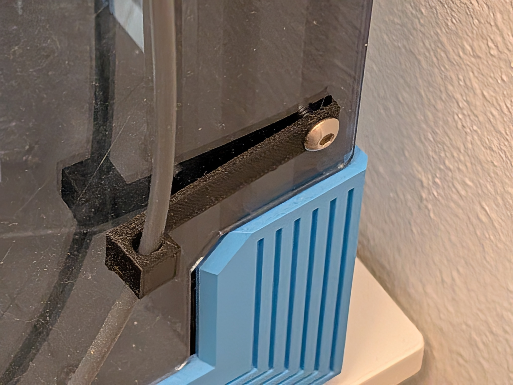

# Ender 6 Extruder Bowden Tube Mount

## Summary

Model to mount a bowden tube beneath the stock extruder on the Ender 6. I use this so I can house my filament in an external dryer instead of on the spool.

Thingiverse Link: https://www.thingiverse.com/thing:7070587

## Model Images

    

        
    

## Print Photos

    

        
        
    

