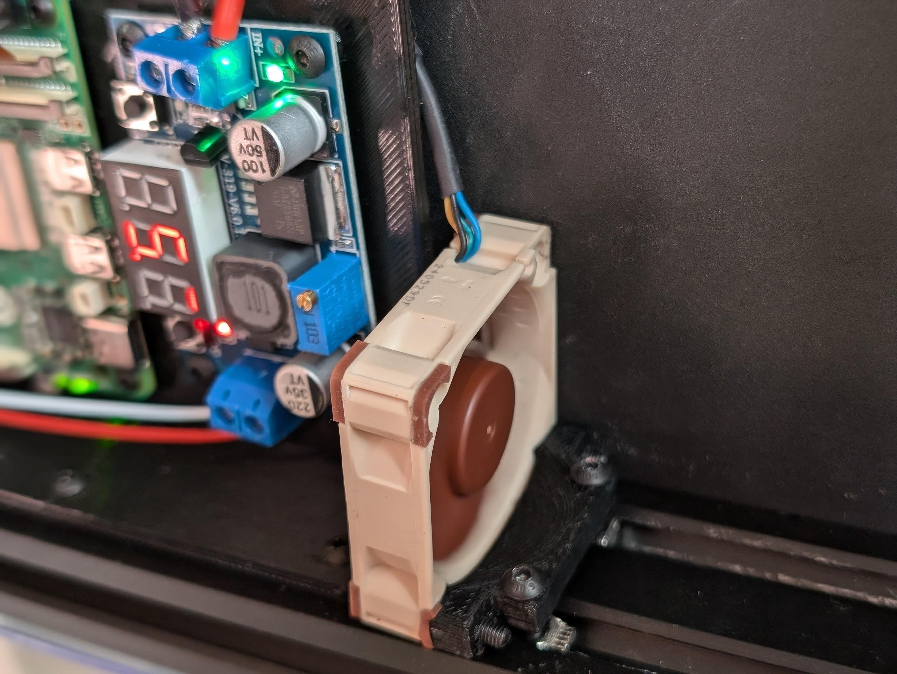

# Ender 6 Extruder Bowden Tube Mount

## Summary

This model was created to keep a Raspberry Pi and Buck Converter cool with a NF-A4x10 that were used to power an Ender 6 running Klipper. There is no reason the fan couldn't be mounted elsewhere on the gantry as per the design.

Fan Link: https://www.amazon.com/dp/B07DXS86G7

Thingiverse Link: https://www.thingiverse.com/thing:6784980

## Model Images

    

        
    

## Print Photos

    

        
    

