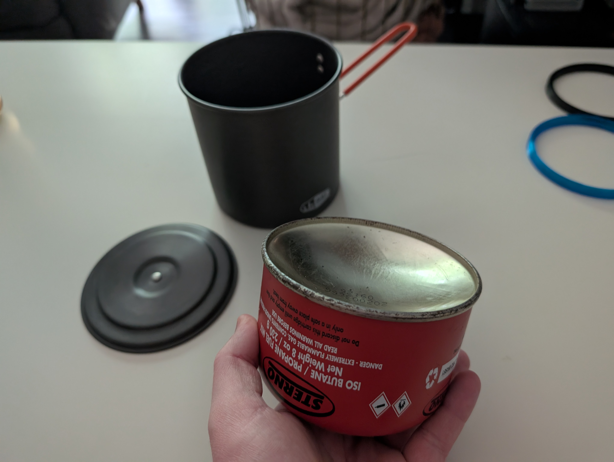

# Fuel Canister Rust Guard

## Summary

Like many others I store my fuel canister inside my cooking pot while backpacking. I've found that on longer trips moisture gets trapped in the pot and eventually causes the metal ring on the bottom of the canister to rust. This ruined my first pot and yesterday I noticed another ring is starting to form on the replacement. So I sat down and designed a 3D model to snap onto the ring to protect the pot. 

Attached are three models. They are mostly the same, except that the 1mm variants have a 1mm tall base while the 3mm variant has a 3mm tall base. While printing these, I found that the 1mm base prints excellent with TPU, but is fragile with harder filaments like PETG. So I recommend using TPU if possible. After all, we're all always searching for a reason to use that old spool we have laying around, right?

With my TPU filament and slicer settings, the 1mm variants weighed 6 grams and the PETG variant weighed 11 grams. I produced a "Swiss Cheese" version in an effort to cut another gram or two off but the final result ended up weighing the same. And also printed terribly on my Ender 6. So I don't really recommend using that. But it was fun to learn how to model ellipses and circular patterns in Fusion 360 so I uploaded it anyway. 

If you print with a filament like PETG or PLA, I recommend increasing your wall count and infill percentages to improve strength. And also using a strong, yet flexible, infill pattern like Gyroid. These settings essentially do nothing with the 1mm variants, however, since all of the faces of the model are very thin. 

Thingiverse Link: https://www.thingiverse.com/thing:7072416

## Model Images

    

        
    

## Print Photos

    

        
        
        
        
        
        
        
    

