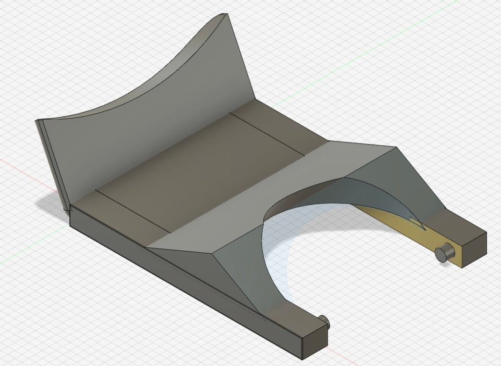

# Krups Espresso Mini 963 Portafilter

## Summary

The plastic piece on my espresso machine's portafilter broke. It's sole use was to provide a way to empty the grounds without the inner cup falling out. So I made a replacement as my first 3d model. 

Thingiverse Link: https://www.thingiverse.com/thing:5254105

## Model Images

## Print Photos

    

        
        
    

