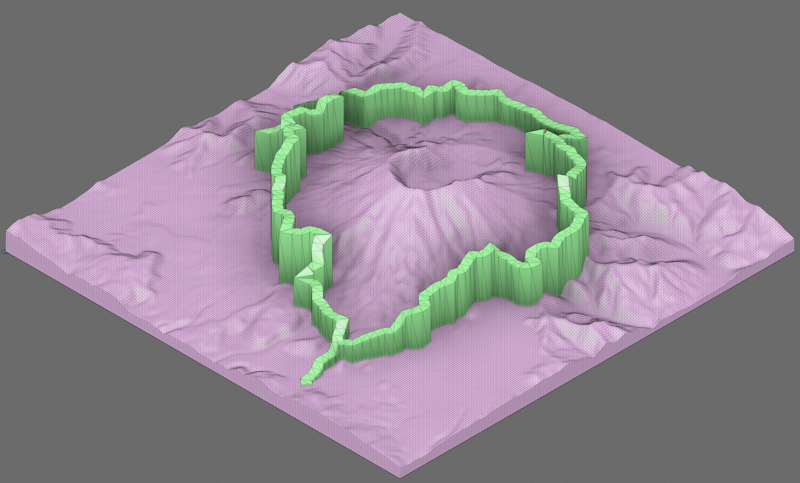

# Loowit 50K

## Summary

This model was inspired by my first 50K around Loowit (AKA Mt. St Helens). I exported the GPX file from my run and used [GPXtruder](https://gpxtruder.xyz/) and [TouchTerrain](https://touchterrain.geol.iastate.edu/) to design a model overlaying the GPX track on the terrain. 

Thingiverse Link: https://www.thingiverse.com/thing:6264204

Strava Link: https://www.strava.com/activities/7481167765

## Model Images

## Print Photos

    

        
        
    

