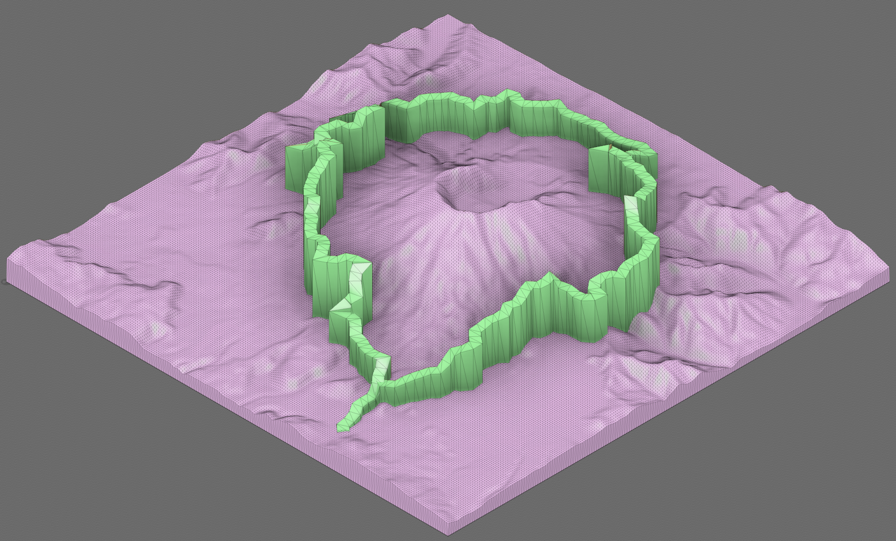
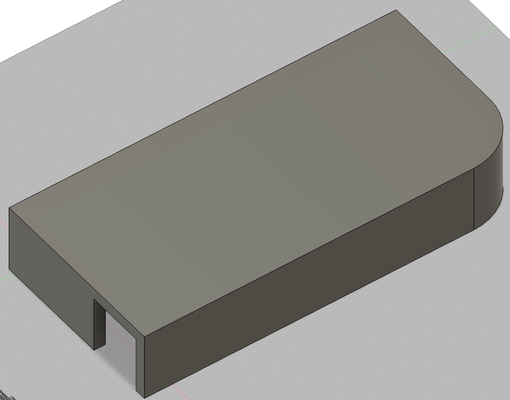
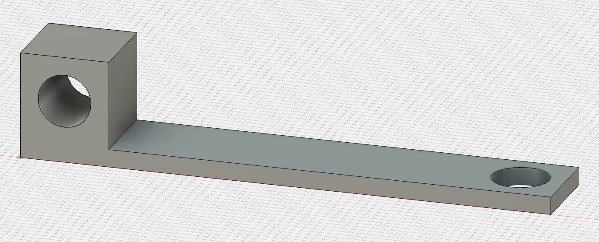
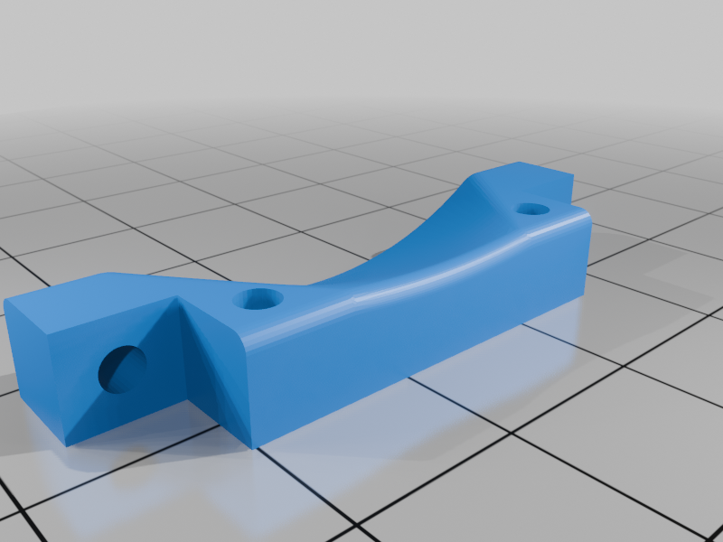
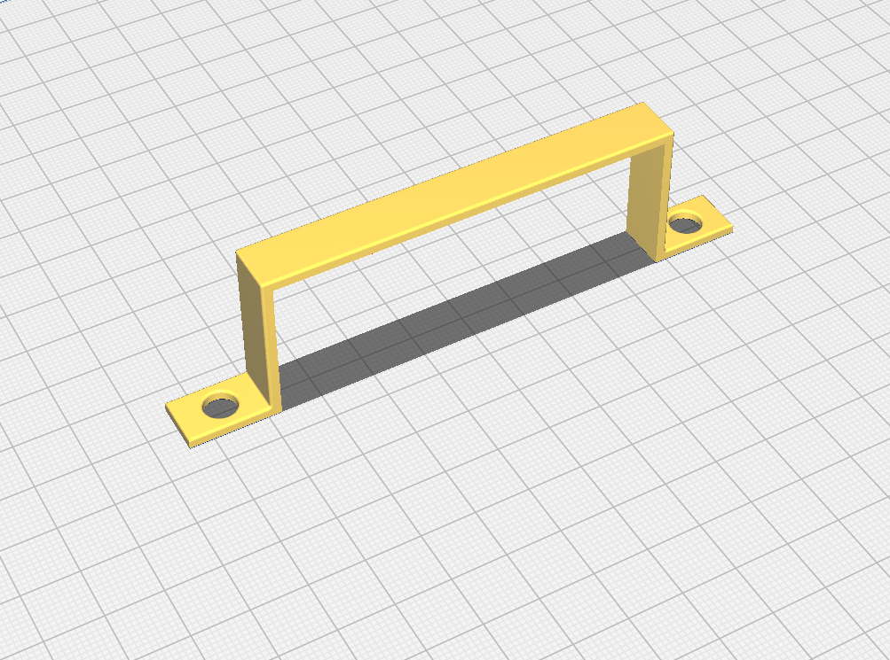
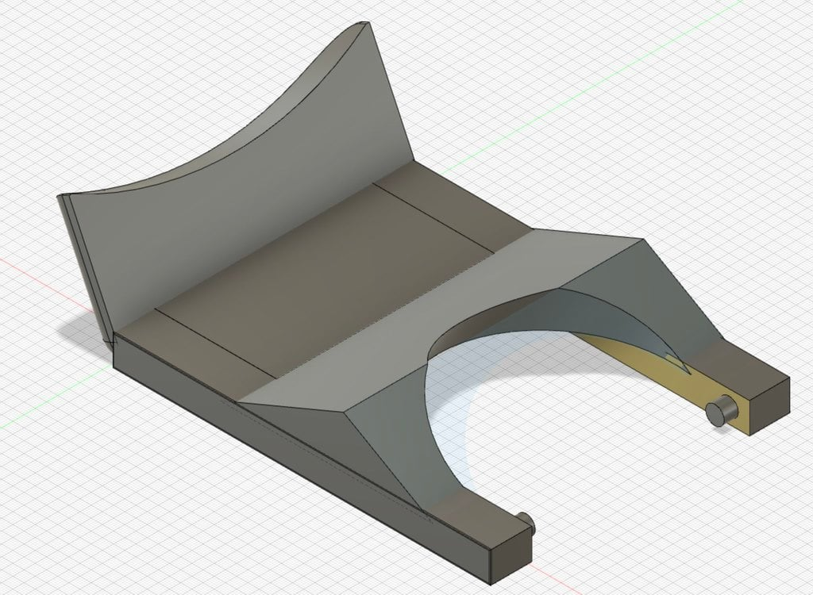

# 3D Models

## Summary

A collection of 3D models I've designed and created with my 3D printer.

A collection of my makes can be found on Thingiverse here: https://www.thingiverse.com/zimmertr/designs

## Examples

    

        
        
        
        
        
        
    

