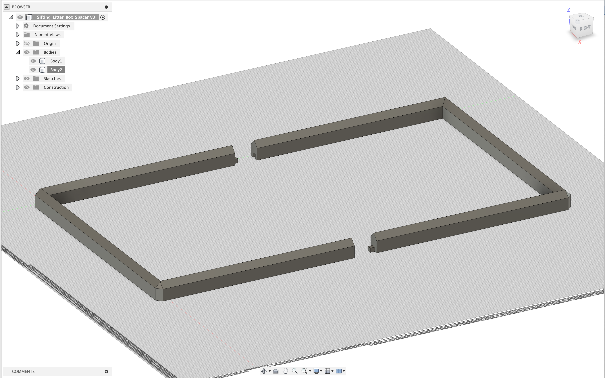
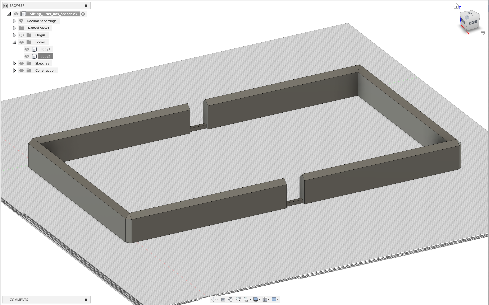
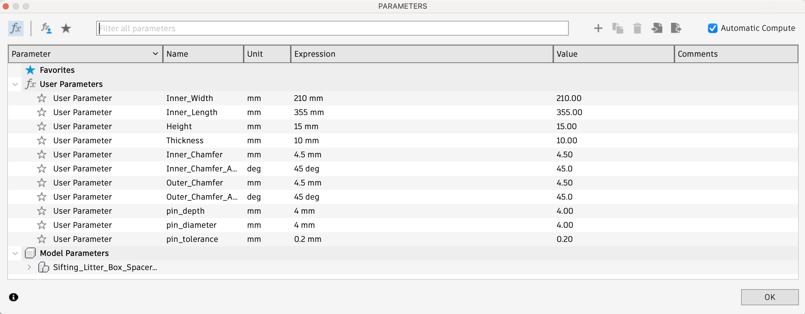

# Sifting Litter Box Spacer

## Summary

I recently bought a [sifting litter box](https://www.amazon.com/dp/B06XNX32K1) to use with [pine pellet litter.](https://www.amazon.com/dp/B004QNJ77Y?th=1) As the pine pellets absorb moisture they turn to dust. During cleaning, owners of this litter box are then expected to shake the litter box with the slotted bottom over one of the solid bottom litter boxes so that the used pellet dust falls through and can be disposed of.

This works okay, but many users have decided to modify this product by gluing cans, blocks, and other objects to the bottom of the solid bottom litter boxes so that the pine pellet dust naturally falls through to the bottom during use to minimize how much handling must then occur by humans. I designed this part to accomplish the same thing. It rests on the bottom of the solid bottom litter box and then the pellet dust falls through into the negative space that is created. The model comes to a point so that dust is dispersed around it and does not rest between it and the slotted bottom box. The model can then be removed when you are ready to clean the box.

I have split the model into two bodies so that it can be printed on my Ender 6 and designed it with pins that slide into one another so you can glue them together afterwards. I uploaded both a 15mm and 30mm variant which adjusts both the height of the spacer as well as the length of the pins. You can find further parameters in the Fusion 360 files to configure it yourself as well. A taller spacer is more ideal, but my litter box is located within a [small piece of furniture](https://www.amazon.com/dp/B0B1LR9KDN) so making it too tall would make it harder for my cats to enter the space.

Supports are required for the pin holes but this model should otherwise be easy to print on most devices.

Thingiverse Link: https://www.thingiverse.com/thing:12345678

## Model Images

    

        
    

    

        
    

    

        
    

## Print Photos

    

        
    

