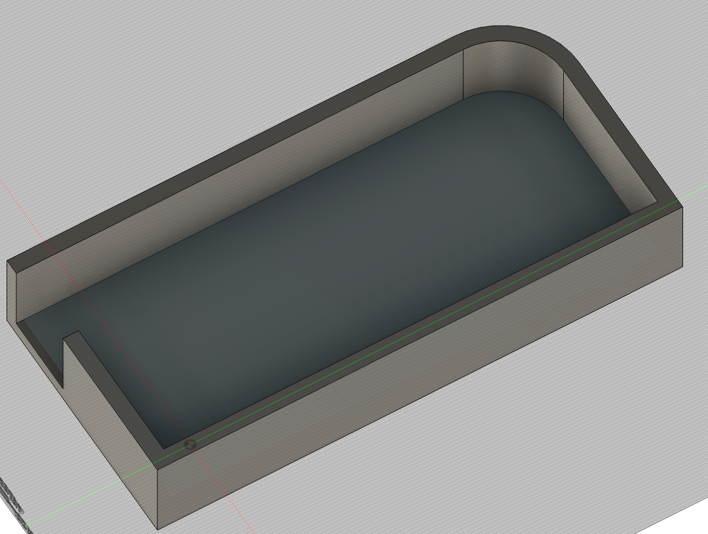
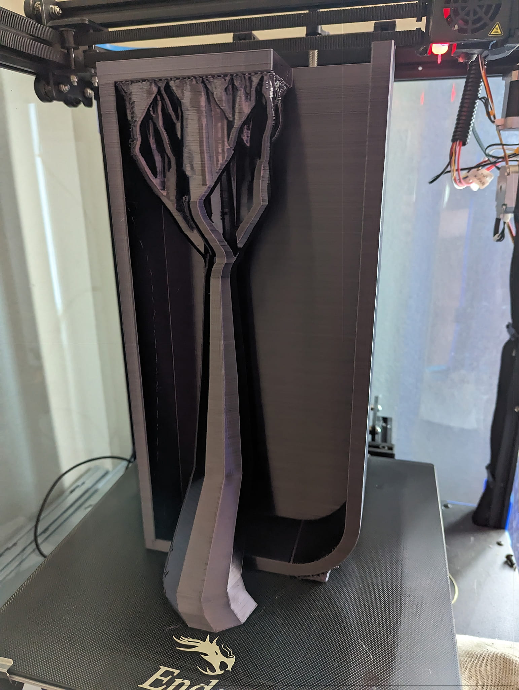
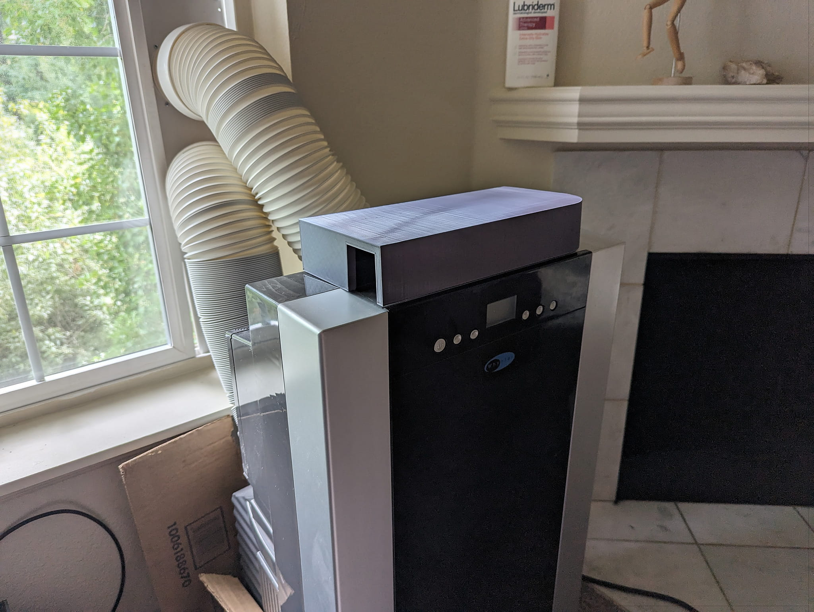
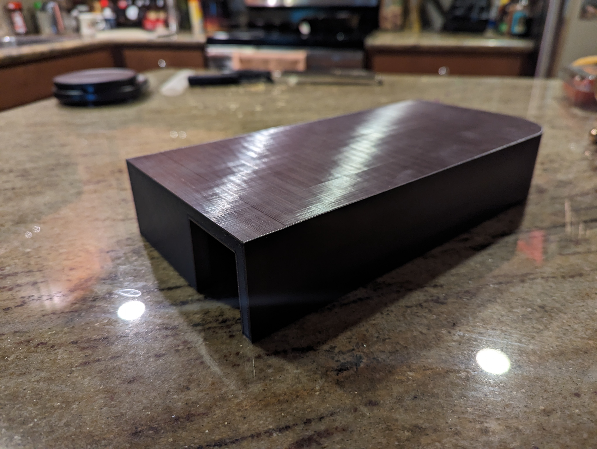
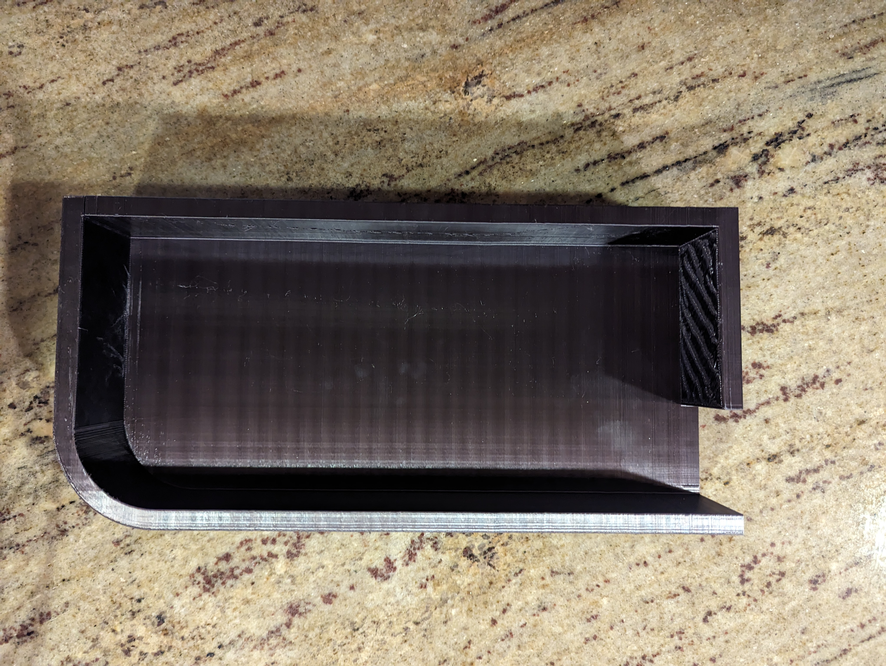

# Whynter ARC-14S Air Conditioner Redirector

## Summary

Seattle isn't known for having hot summers, but it's not rare for a few weeks to bump into the 90s and even 100s. Most houses (and especially apartments) do not come with Air Conditoners. I built this model to redirect the air from my portable air conditioner to my desk.

Thingiverse Link: https://www.thingiverse.com/thing:6264207

## Model Images

    

        
        
    

## Print Photos

    

        
        
    

    

        
        
    

